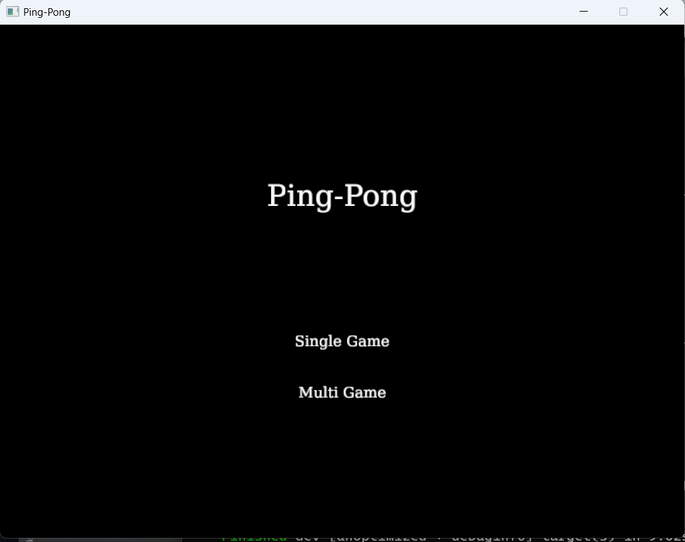
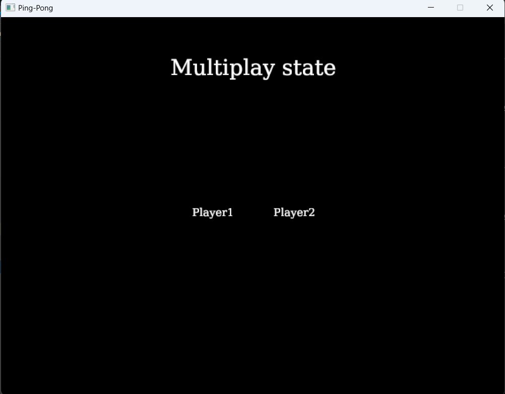
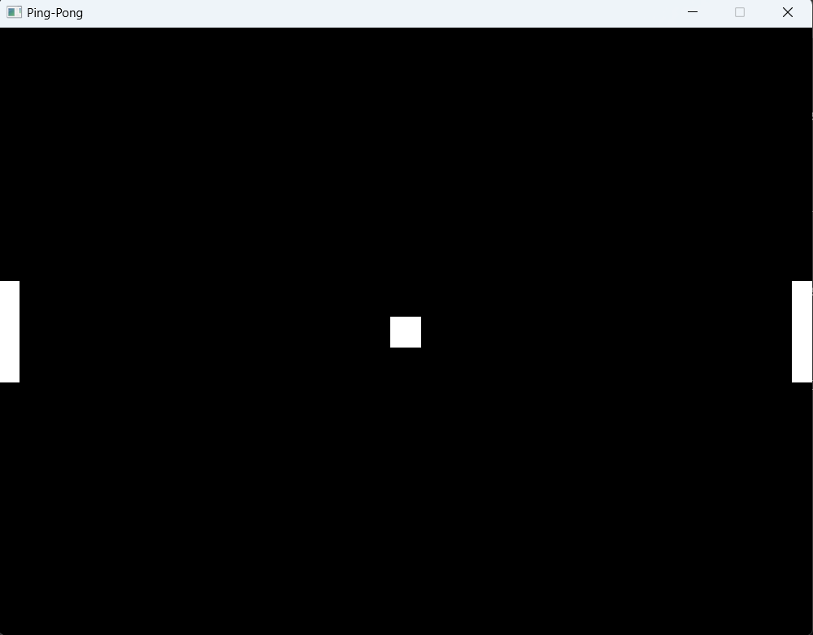

Ping-Pong Game
==============
Ping-Pong 게임은 플레이어가 racket을 조종해 ball을 상대편에게 보내 점수를 득점해 나가는 게임입니다.
싱글플레이시에는 플레이어 1명이 racket 하나를 조종하고 Ai 가 조종하는 racket을 상대하고 멀티 플레이시에는 서버에 player1, player2를 선택해 두명의 플레이어가 각자의 racket을 조종해 경쟁해 나갑니다.
ball이 플레이어의 racket 너머로 넘어가면 상대 플레이어 득점하고 다음 라운드로 넘어가며 ball이 중앙에서 랜덤한 방향으로 움직입니다.

실행 언어 및 설치 라이브러리
--------------
> ## Rust
> 
> Cargo.toml의 [dependencies]에 들어가 설치해야 하는 라이브러리 입니다.
> >   * ggez = "0.5.1"
> >   * rand = "0.7.3"
> >   * serde = "1.0"
> >   * serde_json = "1.0"
> >   * socket2 = "0.4"
> >   * net2 = "0.2"

플레이 방법
--------------
> 해당 라이브러리가 설치되어 있어야 하며, 버전이 맞지 않으면 오류가 생길 수도 있습니다.
>   1. 터미널로 다운 받은 코드로 이동하고 cargo run으로 실행을 시킵니다.
>   2. AI와 대결을 하고 싶으면 Single Game 버튼을, 다른 플레이어와 대결을 하려면 Multi Game 버튼을 마우스로 클릭합니다.
>   
>   
>   3. Multi Game 버튼을 클릭 할 시에 각자 왼쪽 Racket을 조종할지, 오른쪽 Racket을 조종할지 정하고 왼쪽은 player1을, 오른쪽은 player2를 클릭합니다.
>   
>   
>   4. 방향키 위, 아래 키로 Racket을 조종해 플레이 하시면 됩니다.
>   

게임 규칙
---------------
* Racket을 움직여 ball을 반대편으로 넘기면 점수를 득점합니다.
* 점수가 5점을 넘기면 게임이 게임이 끝나고 메인화면으로 넘어갑니다.

수정 사항
-----------
> ### 중간 발표 시점 목표
> * 서버 코드를 한 코드에 통합하여 실행
> * 다른 기기에서의 통신 기능
> * 멀티플레이 버튼을 누르면 방 만들기와 포트 번호를 입력하는 window와 그 window로 이동 할 수있도록 하는 버튼
> * 방 만들기 버튼을 누르면 서버가 실행, player2를 기다리며 포트를 보이는 window
> * 게임에 득점한 점수를 출력
> * 어느정도 득점을 하면 게임 종료
> ### 최종 수정본
> * 점수와 득점하면 게임종료 부분 구현 완료
> * 서버 코드를 따로 구현해서 제 3의 기기에서 서버를 구동
> * 서버를 따로 구동하여 다른 기기간에 통신을 구현
> * 포트 번호는 코드에 입력하여 방 만들기와 포트 번호를 입력하는 기능은 player1, player2로 실행하는 기능으로 변경
